# Gold as a Hedge Strategy

# Background
#### Gold is often said to be a store of value against inflation. Gold is also often said to be a hedge against volatility in equity markets. Leveraging some classical economic thought, this makes sense at surface level: lower interest rates cause inflation, devalue the currency, and diminish the returns of bonds, so people flock to gold. As for equity markets, nobody likes to lose money. When equity markets have satiated an investor's appetite for risk, some of those funds will flow into gold. But this would assume a perfectly rational investor, and I don't think I've ever met one in real life. Let's see how these taken-for-granted relationships hold up alongside the most recent 10 years of data.

## We'll attempt to use time series modeling to predict the daily price, daily price difference, and daily percent change in price of gold.
### We have the most recent 10 years of daily data from the following sources:
### Features:
#### Top 5 equity market indices by market capitalization, per Statista: https://www.statista.com/statistics/270126/largest-stock-exchange-operators-by-market-capitalization-of-listed-companies/, and their corresponding daily performance and percent change
- NYSE Composite Index history: https://finance.yahoo.com/quote/%5ENYA?p=^NYA&.tsrc=fin-srch
- NASDAQ Composite Index history: https://finance.yahoo.com/quote/%5EIXIC?p=^IXIC&.tsrc=fin-srch
- Japan Exchange Group Composite Index history: https://finance.yahoo.com/quote/8697.T?p=8697.T&.tsrc=fin-srch
- Shanghai Stock Exchange Composite Index history: https://finance.yahoo.com/quote/%5ESSEC?p=^SSEC&.tsrc=fin-srch
- Hang Seng (Hong Kong) Index History: https://finance.yahoo.com/quote/%5EHSI?p=^HSI&.tsrc=fin-srch
#### Top 5 Currencies Globally in Forex Trading (https://www.ig.com/us/trading-strategies/top-10-most-traded-currency-pairs-191206), and their corresponding daily central bank policy rates and percent change
- The Fed (USD): https://fred.stlouisfed.org/series/FEDFUNDS
- ECB (EUR): https://www.ecb.europa.eu/stats/policy_and_exchange_rates/key_ecb_interest_rates/html/index.en.html
- BoJ (JPY): https://fred.stlouisfed.org/series/IRSTCI01JPM156N
- United Kingdom (GBP): https://fred.stlouisfed.org/series/GBPONTD156N
- Australia (AUD): https://www.rba.gov.au/statistics/cash-rate/

### Targets:
#### Daily price of gold, daily difference in gold price, daily percent change price of gold: https://www.usagold.com/reference/prices/goldhistory.php

## EDA
### Historical Gold Data Trends and Moving Averages

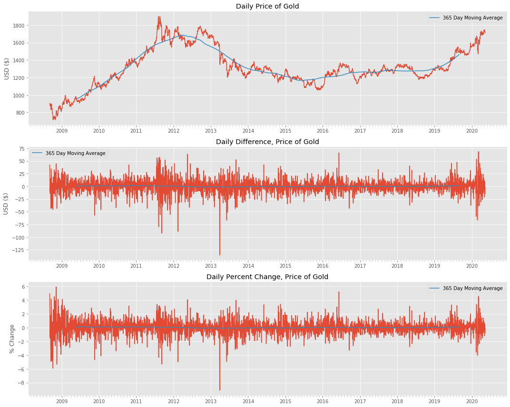

## EDA
### Historical Gold Data Trends Alongside All Features

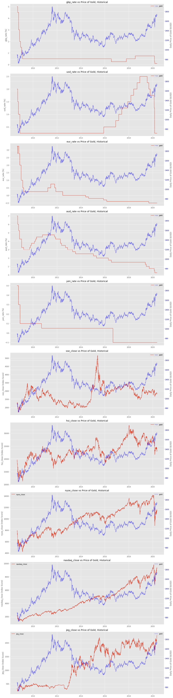


### Raw Data Trends - Price of Gold, Central Bank Policy Rates, and Global Index Summary:
While there are periods of time within the data the gold moves in tandem with our features, those trends and not consistent throughout our entire time window of the most recent ten years.

- Rates that stick out to me: Euro, Australian Dollar
- Stock indices that stick out to me: Nasdaq, NYSE


### So perhaps our features aren't as predictive as we have been led to believe. Let's first try to predict gold's price based on its own lagged price, then we can see if any of our remaining features can positively contribute to our model.

## EDA
### Testing for Gold for Stationarity with Augmented Dickey Fuller

    Daily Price of Gold ADF p-value: 0.397
    Daily Difference, Price of Gold ADF p-value: 0.0
    Daily Percent Change, Price of Gold ADF p-value: 0.0


So we now know that both gold's Daily Price Difference and Daily Percent Change are stationary.
Let's take a look at some autocorrelation and partial autocorrelation plots to see if an AR (auto-regressive) model  would make sense for our baselines

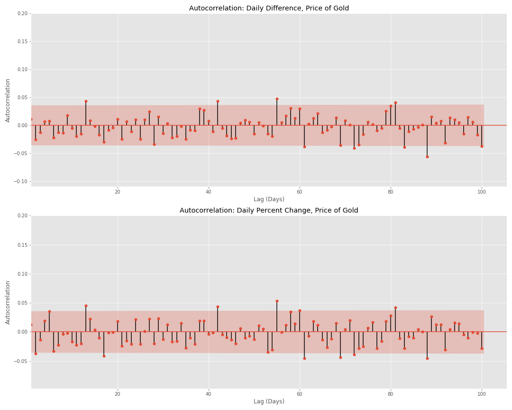

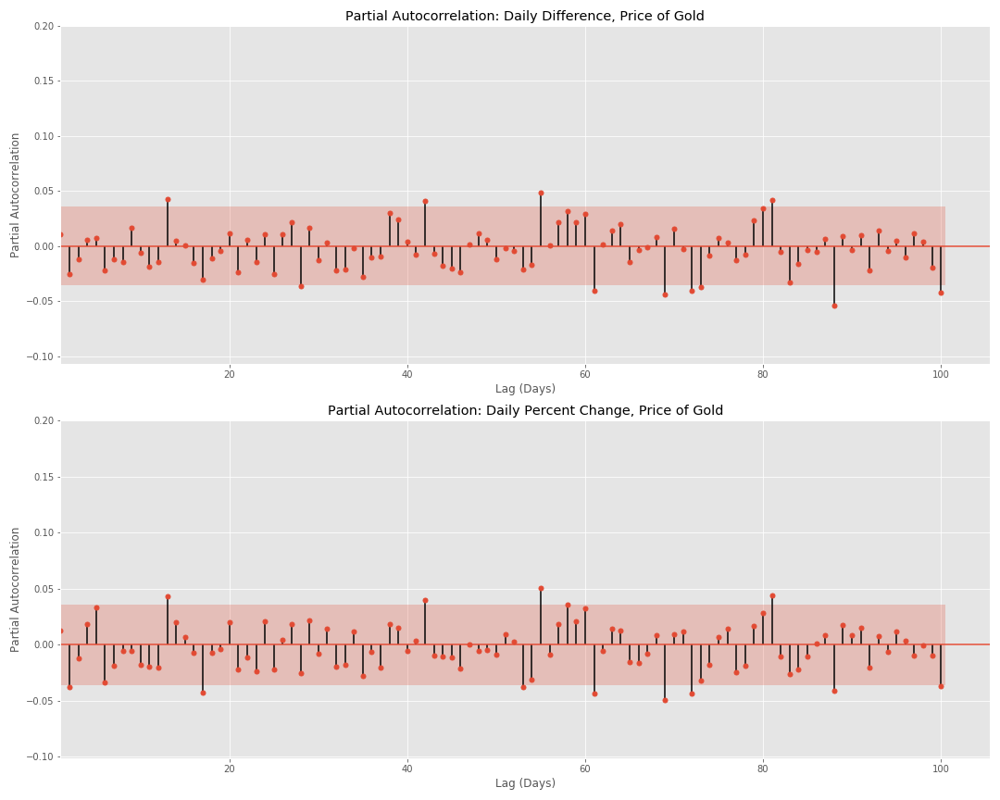


#### While we've proven stationarity in daily price difference and daily percent change, our Autocorrelation plots  aren't encouraging. An AR based model doesn't seem like the proper approach, but linear regression actually assumes an absence of autocorrelation. 
#### To get the simplest of baselines, let's fit a linear model with gold's price difference and price change with the features being a 1 through 10 day lag. Given the dynamic nature of markets, a 10 day lag will help mitigate an extinct trend from a previous timeframe over-influencing our models.

## Linear Model Assumptions:
We may be breaking the rules a bit here. We're really most concerned with generating a baseline model. Who knows?, perhaps the model will pick up something our eyes missed during visual EDA.
- Linear relationship - if this doesn't exist, we'll know because our model will score poorly
- Errors are normally distributed
- Homoscedasticity of errors (or, equal variance around the line) - fit a model and visualize
- Independence of the observations - mostly rule breaking here

## Linear Regression Model: Daily Gold Price Difference (USD), 10 day lag

#### Cross Validation: Linear Regression of Daily Price Difference (USD), 10 day lag

```python
dif_gold_score, dif_gold_model = cross_val_and_score(LinearRegression(),train_X_dif_gold, test_X_dif_gold, train_y_dif, test_y_dif)
```

    Cross_Val 1 Model R^2 Score:-0.055
    Cross_Val 2 Model R^2 Score:-0.011
    Cross_Val 3 Model R^2 Score:-0.026
    Cross_Val 4 Model R^2 Score:-0.033
    Cross_Val 5 Model R^2 Score:-0.016
    Final Model R^2 Score:-0.014

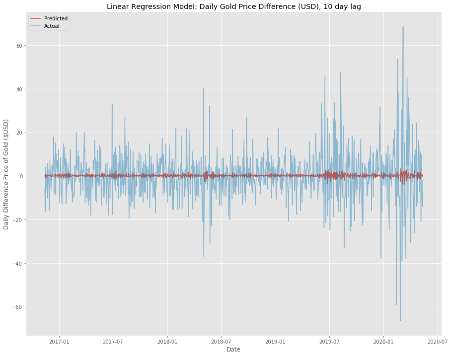


### Linear Regression Model: Daily Gold Price Percent Change, 10 day lag

#### Cross Validation: Linear Regression of Daily Gold Price Percent Change, 10 day lag


```python
change_gold_score, change_gold_model = cross_val_and_score(LinearRegression(),train_X_change_gold, test_X_change_gold, train_y_change, test_y_change)
```

    Cross_Val 1 Model R^2 Score:-0.065
    Cross_Val 2 Model R^2 Score:-0.022
    Cross_Val 3 Model R^2 Score:-0.022
    Cross_Val 4 Model R^2 Score:-0.036
    Cross_Val 5 Model R^2 Score:-0.011
    Final Model R^2 Score:-0.019

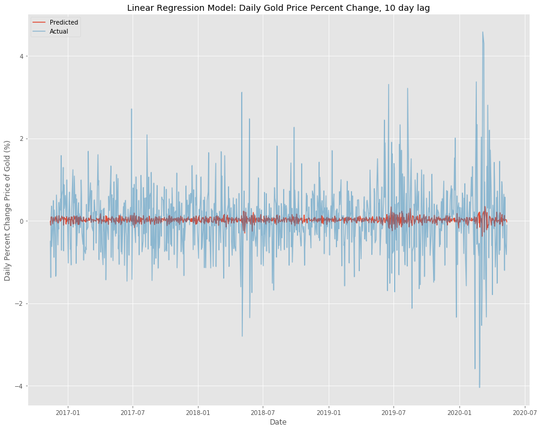


### Linear Regression for Gold Price 10 Day Lag Summary:
A simple linear model is doing more harm than good when using a ten day lag to predict both the Daily Price Difference (R^2 Score = -0.008) as well as the Daily Percent Change in Price (R^2 Score = -0.019).

#### Idea: Let's tryout a different model with again just the 10 day lag for only gold price data. A moving average feels like a reasonable next step, given its prominence as a technical indicator in the world of online trading. 

## 10 Day Moving Average Regressor: Daily Gold Price Difference (USD)

#### Cross Validation: 10 Day Moving Average Regression Daily Gold Price Difference (USD)

```python
ma_dif_gold_score = cross_val_and_score_ma(train_y_dif_ma,train_y_dif,test_y_dif_ma,test_y_dif)
```

    Is this moving average a classifier(enter "c") or regressor(enter "r")?r
    Cross_Val 1 Model R^2 Score:-0.119
    Cross_Val 2 Model R^2 Score:-0.077
    Cross_Val 3 Model R^2 Score:-0.117
    Cross_Val 4 Model R^2 Score:-0.13
    Cross_Val 5 Model R^2 Score:-0.089
    Final Model R^2 Score:-0.13

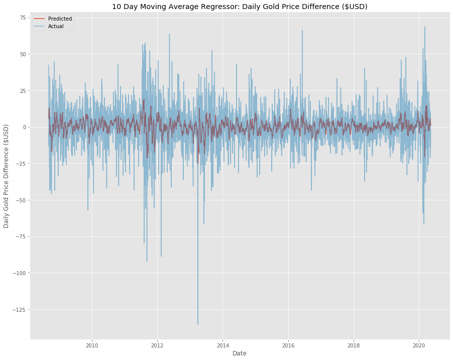


## 10 Day Moving Average Regressor: Daily Percent Change Gold Price

#### Cross Validation: 10 Day Moving Average Regression Daily Percent Change Gold Price


```python
ma_change_gold_score = cross_val_and_score_ma(train_y_change_ma,train_y_change,test_y_change_ma,test_y_change)
```

    Is this moving average a classifier(enter "c") or regressor(enter "r")?r
    Cross_Val 1 Model R^2 Score:-0.121
    Cross_Val 2 Model R^2 Score:-0.077
    Cross_Val 3 Model R^2 Score:-0.116
    Cross_Val 4 Model R^2 Score:-0.129
    Cross_Val 5 Model R^2 Score:-0.085
    Final Model R^2 Score:-0.127

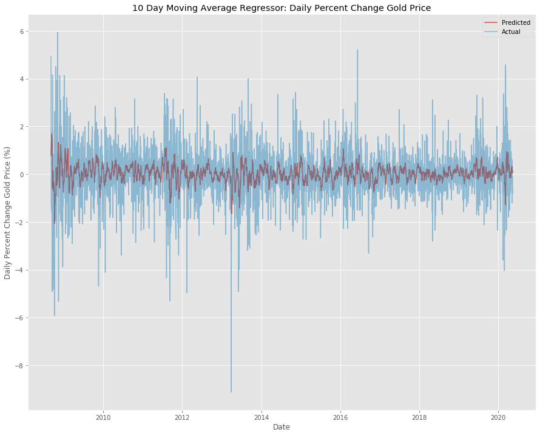


### 10 Day Moving Average Regressor for Gold Price Summary:
A 10 Day Moving Average Regressor also does a poor job in explaining variation in the Daily Price Difference (R^2 Score = -0.13) as well as the Daily Percent Change in Price (R^2 Score = -0.13).

#### Idea: A gradient boosting regressor comes to mind, because all of our target and feature variables are continuous, and it's evident both linear regression and moving-average models do a poor job of explaining gold's variation in price. 

## Gradient Boosting Regressor: Daily Gold Price Difference, 10 day lag

#### Cross Validation: Gradient Boosting Regressor of Daily Gold Price Difference, 10 day lag


```python
dif_gold_score, dif_gold_model = cross_val_and_score(GradientBoostingRegressor(learning_rate = .01),train_X_dif_gold, test_X_dif_gold, train_y_dif, test_y_dif)
```

    Cross_Val 1 Model R^2 Score:-0.002
    Cross_Val 2 Model R^2 Score:-0.079
    Cross_Val 3 Model R^2 Score:-0.042
    Cross_Val 4 Model R^2 Score:-0.019
    Cross_Val 5 Model R^2 Score:0.001
    Final Model R^2 Score:-0.011

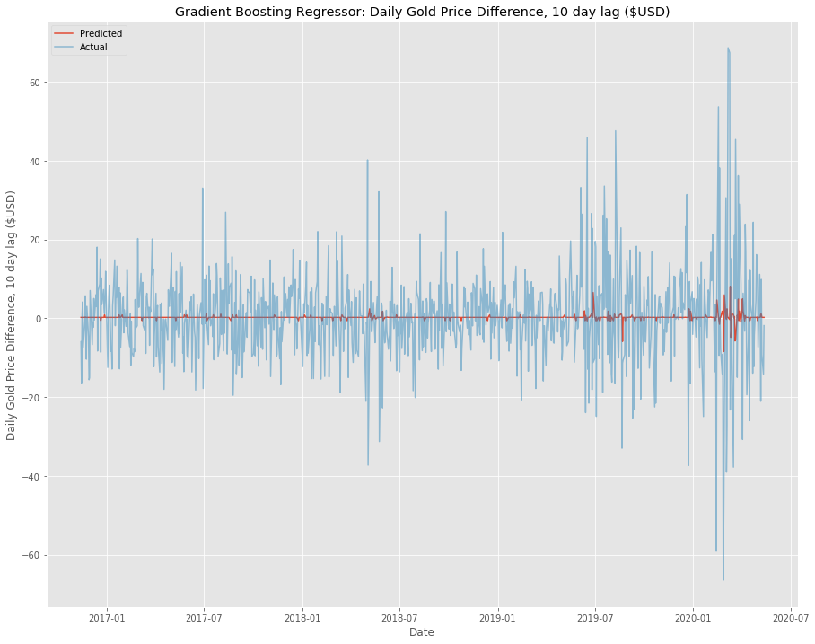


## Gradient Boosting Regressor: Daily Percent Change Gold Price, 10 day lag

#### Cross Validation: Gradient Boosting Regressor of Daily Gold Price Difference, 10 day lag


```python
change_gold_score, change_gold_model = cross_val_and_score(GradientBoostingRegressor(learning_rate = .01),train_X_change_gold, test_X_change_gold, train_y_change, test_y_change)
```

    Cross_Val 1 Model R^2 Score:-0.011
    Cross_Val 2 Model R^2 Score:-0.007
    Cross_Val 3 Model R^2 Score:-0.024
    Cross_Val 4 Model R^2 Score:-0.02
    Cross_Val 5 Model R^2 Score:-0.018
    Final Model R^2 Score:-0.005

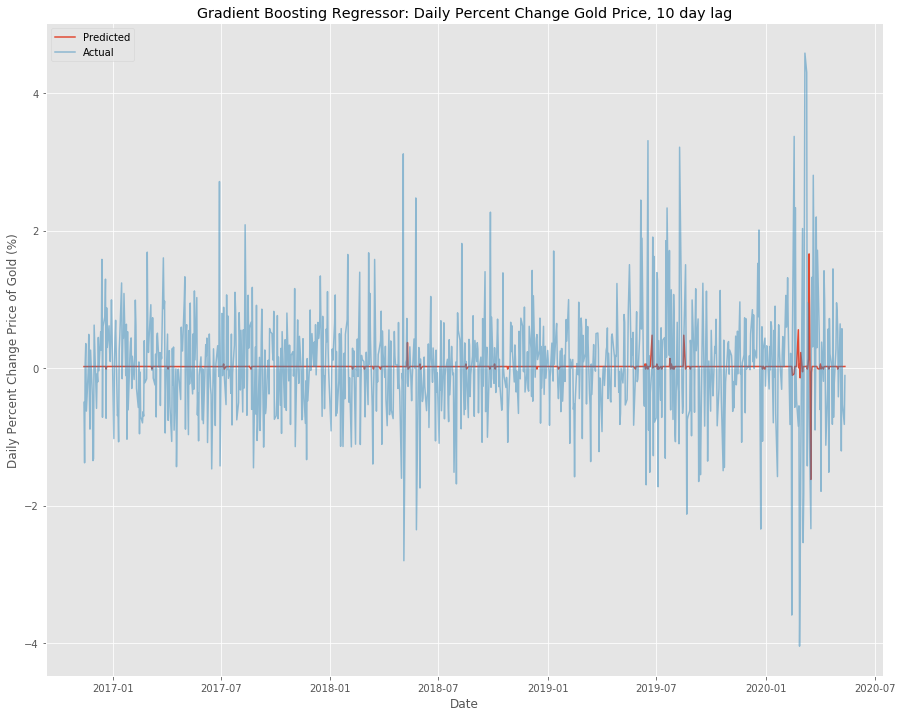


### Gradient Boosting Regression for Gold Price, 10 Day Lag Summary:
We only made an improvement from our Linear Model with respect to Daily Percent Change in Price (R^2 Score = -0.005).
The R^2 score for our Daily Price Difference model actually dropped a bit (R^2 Score = -0.011), 
#### Idea: Let's introduce our other features (stock market index performance, central bank policy rates, and their 10 day lags) to see if any of these metrics can help inform our model. We can use permutation importance to determine which features, if any, are most informative.

## Gradient Boosting Regressor: Daily Gold Price Difference, All Features

#### Cross Validation Gradient Boosting Regressor of Daily Gold Price Difference, All Features


```python
dif_score, dif_model = cross_val_and_score(GradientBoostingRegressor(learning_rate = .01),train_X_dif, test_X_dif, train_y_dif, test_y_dif)
```

    Cross_Val 1 Model R^2 Score:-0.0
    Cross_Val 2 Model R^2 Score:-0.052
    Cross_Val 3 Model R^2 Score:-0.047
    Cross_Val 4 Model R^2 Score:-0.208
    Cross_Val 5 Model R^2 Score:-0.725
    Final Model R^2 Score:-0.023

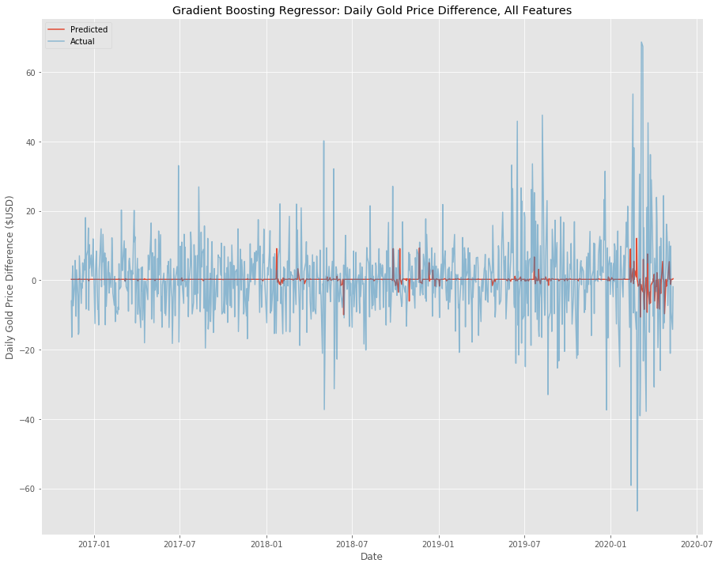


## Gradient Boosting Regressor: Daily Gold Price Percent Change, All Features

#### Cross Validation Gradient Boosting Regressor of Daily Gold Price Percent Change, All Features


```python
change_score, change_model = cross_val_and_score(GradientBoostingRegressor(learning_rate = .01),train_X_change, test_X_change, train_y_change, test_y_change)
```

    Cross_Val 1 Model R^2 Score:-0.001
    Cross_Val 2 Model R^2 Score:0.005
    Cross_Val 3 Model R^2 Score:-0.022
    Cross_Val 4 Model R^2 Score:-0.008
    Cross_Val 5 Model R^2 Score:-0.009
    Final Model R^2 Score:-0.017

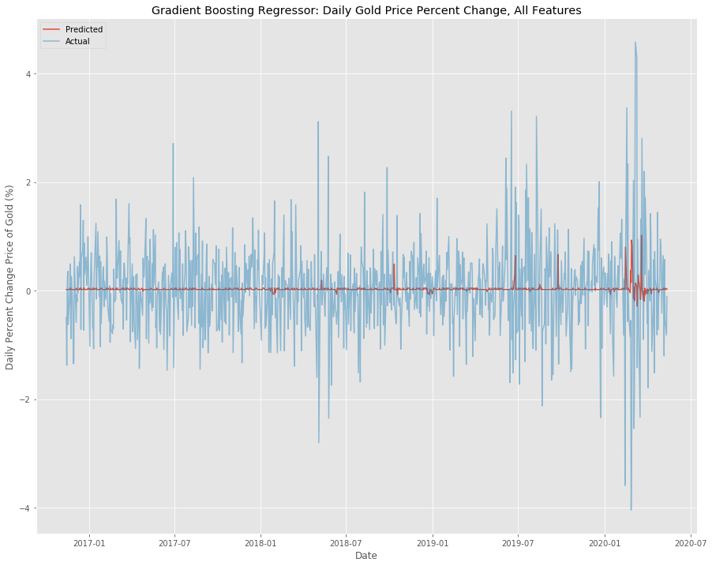


### Gradient Boosting Regression for Gold Price - Stock Indices, Central Bank Policy Rates, and Gold Pricing
Unfortunately, it looks like the introduction of more features to our models actually decreased their accuracy, making them further underform in contrast to a constant prediction: Daily Price Difference (R^2 Score = -0.078), Daily Percent Change in Price (R^2 Score = -0.028).
#### Idea: Thus far, our models have left much to be desired in terms of accuracy. They aren't explaining gold's variation in price difference or price change. However, from an investor's perspective, what is ultimately most important is whether or not the price will increase or decrease within a given time frame. Let's pivot to a classification framework and see if we can't get a better score. 


## Gradient Boosting Classifier: Daily Gold Price Difference, All Features

#### Cross Validation: Gradient Boosting Classifier of Daily Gold Price Difference, All Features


```python
dif_score, dif_model = cross_val_and_score(GradientBoostingClassifier(learning_rate = .01),train_X_dif, test_X_dif, train_y_dif, test_y_dif)
```

    Cross_Val 1 Model Accuracy Score:0.568
    Cross_Val 2 Model Accuracy Score:0.526
    Cross_Val 3 Model Accuracy Score:0.491
    Cross_Val 4 Model Accuracy Score:0.48
    Cross_Val 5 Model Accuracy Score:0.477
    Final Model Accuracy Score:0.551


<div>
<table border="1" class="dataframe">
  <thead>
    <tr style="text-align: right;">
      <th></th>
      <th>Actual Positive</th>
      <th>Actual Negative</th>
    </tr>
  </thead>
  <tbody>
    <tr>
      <th>Predicted Positive</th>
      <td>351</td>
      <td>269</td>
    </tr>
    <tr>
      <th>Predicted Negative</th>
      <td>138</td>
      <td>149</td>
    </tr>
  </tbody>
</table>
</div>


## Gradient Boosting Classifier: Daily Gold Price Percent Change, All Features

```python
change_score, change_model = cross_val_and_score(GradientBoostingClassifier(learning_rate = .01),train_X_change, test_X_change, train_y_change, test_y_change)
```

    Cross_Val 1 Model Accuracy Score:0.554
    Cross_Val 2 Model Accuracy Score:0.523
    Cross_Val 3 Model Accuracy Score:0.494
    Cross_Val 4 Model Accuracy Score:0.457
    Cross_Val 5 Model Accuracy Score:0.491
    Final Model Accuracy Score:0.533


<div>
<table border="1" class="dataframe">
  <thead>
    <tr style="text-align: right;">
      <th></th>
      <th>Actual Positive</th>
      <th>Actual Negative</th>
    </tr>
  </thead>
  <tbody>
    <tr>
      <th>Predicted Positive</th>
      <td>351</td>
      <td>269</td>
    </tr>
    <tr>
      <th>Predicted Negative</th>
      <td>138</td>
      <td>149</td>
    </tr>
  </tbody>
</table>
</div>


### Gradient Boosting Classification for Gold Price - Stock Indices, Central Bank Policy Rates, and Gold Pricing
You may have gotten excited by the score ouputs above growing to be at least positive numbers, but it's important we understand the nuances between scoring classifiers versus regressors. While an R^2 score of 0 for regression implies a model that does no better than guessing a constant, we scored our classifiers using the accuracy metric. In this instance, a score of 0.5 (50%) is actually the threshhold for positively contributing to the prediction of a value.

#### Good news: our classifiers' accuracy scores Daily Gold Price Difference (accuracy = 0.55) and Daily Gold Price Percent Change (accuracy = 0.53) are positively contributing to the prediction of gold's price movement.

#### Bad news: the classifiers are doing so at a rate only slightly better than a coin flip.

# Conclusion
### If a consistent relationship between interest rates, stock market indices, and the price of gold does exist, it doesn't appear to be properly captured with the features we have chosen and a 10 day lag.

### Further study
- Investigate longer lag: it's possible a cyclical trend exists in gold's price movement over a larger window than ten years.
- Investigate polynomial transformations of the variables and possible interaction features with current data before confirming there is no relationship.

